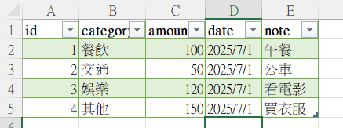
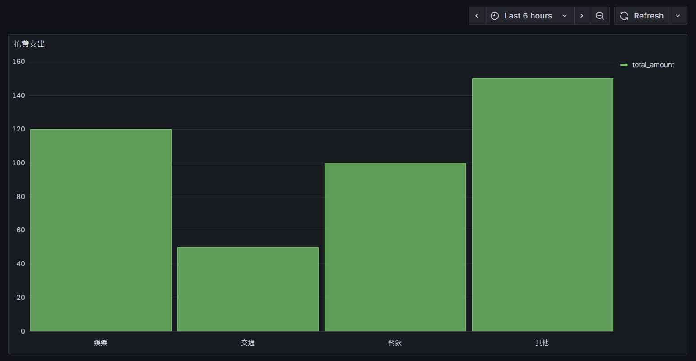

個人支出追蹤小助手
這個專案幫你輕鬆管理支出！從 Excel 匯入數據到 PostgreSQL，再用 Grafana 打造直觀的支出圖表，簡單又好用。
專案內容

scripts/import_expenses.py: 匯入 Excel 數據的 Python 腳本
sql/create_expenses_table.sql: 建置資料庫表格
dashboards/expenses_dashboard.json: 酷炫的 Grafana 儀表板
requirements.txt & .gitignore: 環境設定與檔案保護

快速開始

安裝 Python 3.8+、PostgreSQL 12+、Grafana 10+。
創建 test 資料庫，運行 sql/ 腳本。
安裝套件：pip install -r requirements.txt。
設定 .env 連線資訊，運行 python scripts/import_expenses.py。
在 Grafana 匯入 dashboards/expenses_dashboard.json。

注意
別上傳 dailycost.xlsx 或密碼！有問題？隨時提 issue！
